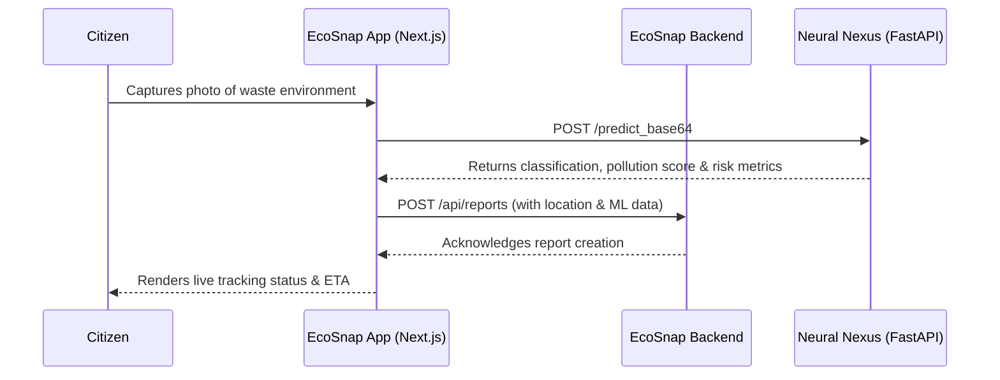
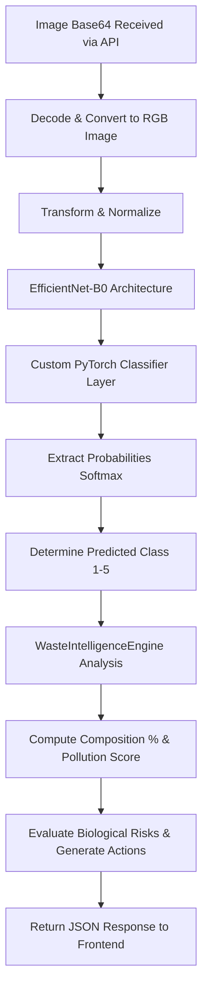
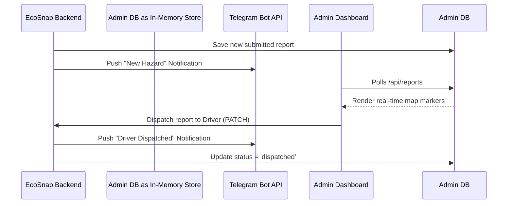
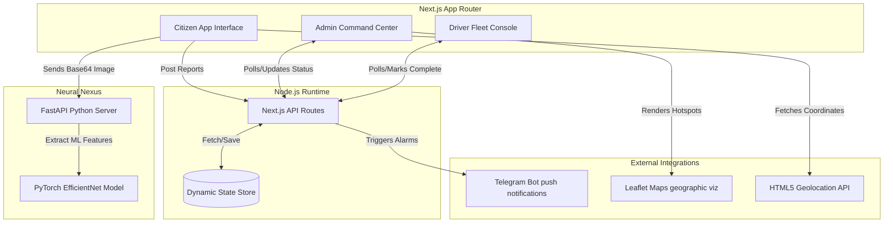

# EcoSnap Application Workflows & Architecture

Below are the 4 workflow diagrams representing different facets of the EcoSnap ecosystem, followed by a visualization of the overall system architecture.

## 1. Citizen Reporting Workflow
This sequence shows the interaction when a user spots varying levels of cleanliness and decides to report the issue using the EcoSnap mobile interface.




## 2. Neural Nexus AI Processing Workflow
A deeper look into how the backend machine learning component processes the incoming reports to provide severity estimations and advanced analytics.




## 3. Command Center & Dispatch Workflow
Outlining how the administrative side operates efficiently. From ingesting new data to alerting both admins and Telegram bots.




## 4. Driver Navigation & Completion Workflow
The driver ecosystem ensures the scalable routing and closure of active incidents on edge devices.


```mermaid
flowchart LR
    A[Driver Field App] --> B[Poll & Receive Dispatched Tasks]
    B --> C{Prioritize Critical Tasks?}
    C -->|Yes| D[Trigger Immediate GPS Nav]
    C -->|No| E[Follow Standard Route]
    D --> F[Arrive at Waste Site]
    E --> F
    F --> G[Complete Cleanup Process]
    G --> H[Mark Status as "Resolved"]
    H --> I[API updates DB & Sends Telegram confirmation]
```

## 5. System Architecture
How all application modules interface with each other.


